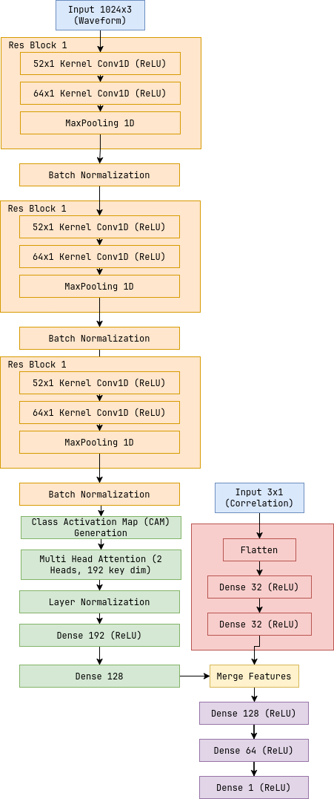

# Microproject PXT992

The goal of this project is to estimate the parameters of unmodeled gravitational wave bursts. The proposed network works by first examining the input data and identifying the most important features to use for estimating the parameters. This is done using a ResNet CNN for feature extraction and a Class Activation Map (CAM) to highlight those important regions. After the important regions have been identified, the data is fed into a transformer to handle the bulk of the predictions. The data is then processed through a Global Average Pooling layer to collapse the time dimension and reduce complexity, and it is subsequently fed into a dense layer for output.

The main metrics used for training and testing are Mean Squared Error (MSE for loss), Mean Absolute Error, and R² Score. All of the code is written using the Keras machine learning library and utilizes TensorFlow.

## Network Architecture

## Decomposing the Architecture

### ResNET CNN
Extracts local patterns from the raw time series input data using convolutional filters
while residual connections help avoid vanishing gradients during deep training.

### Global Average Pooling
Reduces the dimensions of features by averaging values across entire map,
outputting a singe number per channel. Helps reduce the amount of trainable parameters.

### Class Activation Map
Highlights which regions of the input contribute the most to a model's prediction
by computing a weighted sum of the feature maps. It shows what the network is focused on
for decision making.

### Attention Transformer
Learns to focus on the most important parts of the input data by assigning higher weights
to relevent regions. Complements CAM by learning to amplify important regions during
training.

### Dense Layer and K Depth Output
Flattens and transforms the extracted features into a vector for the final output.
Aggregates all learned features to make the final prediction. Standard dense layer is fully
connected with ReLU or Linear Activation, Dropout layer Adds regularization to 
prevent overfitting, Batch Normalization stabalizes gradients and speeds up training.

### Benefits

- Interperability
    - The CAM provides insights into what regions of the time series data influence
    the predictions, making the model more explainable. Useful in gravitatational
    wave analysis where understanding which time segments contribute most to predictions.

- Feature Extraction Efficentcy
    - The ResNET CNN architectire effectivly captures local patterns in time series, ideal
    for detecting short bursts/ transient events.

- Focused on relevent patterns
    - The trainable attention mechanism emphasizes regions highlighted by CAM 
    ensuring the model focuses on key patterns linked to the output such as mass
    and distance.

- Combination of local and global inforamtion
    - CNN layers capture local temporal features while attention helps model long
    range dependencies.

### Limitations

- Computational complexity
    - The attention layer and cam increase the models complexity and training time

- Resolution loss
    - GAP compresses the feature maps potentailly disguarding fine grained temporal
    details.

### Summary

| Model | Benefits | Limitations |
| --- | --- | --- |
| CNN + CAM + Attention | High Interperability, effective local feature extraction, enhanced by attention | Computationally heavy, may lose fine details with GAP |
| Vanilla CNN (No CAM) | Fast and effective for local patterns | No interperability, lacks focus on key regions |
| RNNs | Captures temporal dependencies well | Harder to interpret, strugles with long sequences |
| Transformers | Captures long range dependencies well | Resource intensive for large inputs |
| Hybrid CNN-RNN | Local (CNN) + Long-term (RNN) combination | More complex and slower training |

## Further reading

[1] V. Skliris, M. R. K. Norman, and P. J. Sutton, ‘Real-Time Detection of Unmodelled Gravitational-Wave Transients Using Convolutional Neural Networks’, Jun. 18, 2024, arXiv: arXiv:2009.14611. doi: 10.48550/arXiv.2009.14611.
